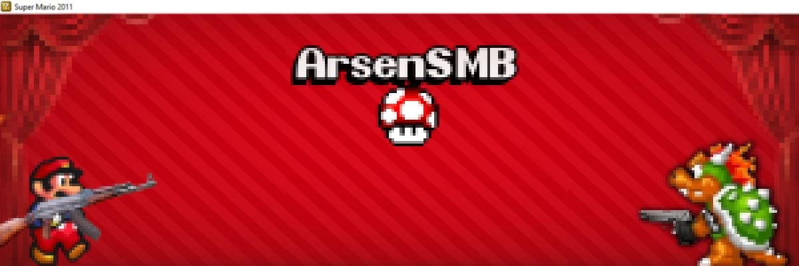
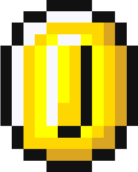
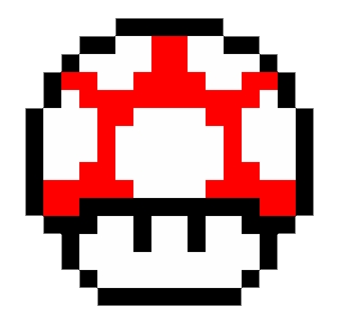

# 🍄 Sup everyone I'm Arseniy Volkov 

*17-year-old level designer, born in a "booming" city, and raised in hell... (just a bit of irony, y'know)*

---

### 🕹️ About Me & My Grind

Right now, I'm fully focused on creating custom episodes for the fan-made **Super Mario 2011**. I basically playtest my own maps **24/7**, balancing between standard, well-polished levels and hardcore, kaizo/bug-abusing madness. The grind never stops! 🛑

Before this, I built stuff in **Mario Worker** and messed around with several other level editors. Since I'm only 17, I'm still very much in the learning phase, but I'm loving every bit of it.

   - 📚 **I’m currently learning:** A lil bit of everything! Exploring level, game logic, and custom graphic textures.
   - 🤑 **Collector Core:** I'm into numismatics and bonistics (basically, I collect rare coins and banknotes around the world, yea even the old ones).
- 🔮 **The Anti-Scam Mystic:** I’m a former fortuneteller raid leader (shoutout to some shit channel so-called *Bomjplace*). Ironically, I read Tarot cards myself—mostly for guidance or a 50/50 shot at predictions—while simultaneously calling out fake online seers and scams. 

---

### 🧠 What’s the Point of All This?

Briefly, this journey gives me hands-on experience in:
* 🗺️ **Level Construction** – Mastering pacing, difficulty curves, and player flow.
* 🧪 **Playtesting** – Breaking my own maps to make sure they are glitch-perfect.
* 🎨 **Graphic Design** – Currently surviving on *IbisPaint* to whip up custom backgrounds and floor textures.
* 💡 **Creativity** – Finding ways to unleash my ideas and bring them to life despite heavily limited tools.

---

### 🛠️ My Toolbox

I work with classic level editors that are, honestly, pretty limited. Aside from using *IbisPaint* for some custom tile work, **everything is built straight inside the editor's constraints.** Turning limitations into features is my favorite challenge!

---

###

🎞️ **Feel free to watch My Gameplays:** [My YouTube Channel](https://youtube.com)  
